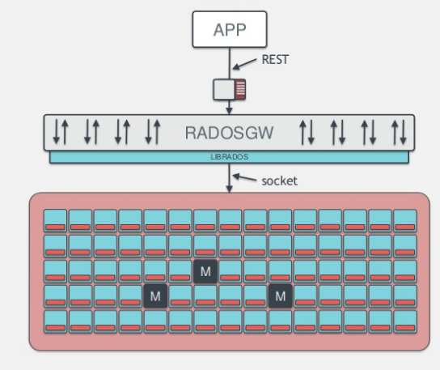

## RGW
+ Object storage client to the ceph cluster, exposes a RESTFUL S3 & Swift API

--

### RGW
+ A RESTful API access to object storage (swift/s3)
+ Immutable objects, not 1:1 mapped to rados objects
+ Implements user accounts, acls, buckets
+ heavy ecosystem of s3/swift client tooling can be leveraged against RGW

---

### RGW
+ Supports a lot of S3/swift like features
  - Multipart uploads
  - Object Versioning
  - torrents
  - lifecycle
  - encryption
  - compression
  - static websites
  - metadata search...
+ From Jewel we support multisite which allows geographical redundancy

---

## Multisite

+ Geographical redundancy with async data replication*
+ Data is replicated across zones, within zonegroups. Realms can
  partition data in to namespaces.
+ Built on principle that data changes are frequent, metadata changes
  not so much
+ There is a master zone which will be the source of truth for all
  metadata
+ Data CP in local cluster, AP in remote

--

### Async Export?

Since we have the ability to notify the remote zone on data changes,
an we utilize this for further external services?

---

## Sync Modules
+ Built atop of multisite
+ Leverages async metadata and data logs to decide on further actions
+ Modules can define whether they export data or only consume data.
+ Multisite itself is a default 'sync module'
+ Currently requires in-tree builds {C++} 

--

+ Require their own zone 
+ Allows for integrating external services based on data/metadata in
  RGW
+ For getting started writing one look at the log sync module

---

## ElasticSearch

+ Sends object metadata to elasticsearch
+ Exposes a end-user api to forward queries to ES
+ Also get an overview of interesting object storage trends with ES queries

--

</img>

---

## Cloud Sync Module

+ Back up to a different cloud with s3 like apis (S3 itself?)
+ A cloud provider redundancy of sorts, useful for critical data backups
+ Configurable mapping for buckets/users

---

## Archive Sync Module

+ Archives every object (uses object versioning)
+ Allows for only one cluster to be an archive cluster with other
  clusters free to delete the different object versions over time

---

## Pub Sub 

+ Subscribe to notifications on modification events for a topic (a
  bucket)

---

- wiki: https://en.opensuse.org/openSUSE:Ceph
- [opensuse-ceph@opensuse.org](mailto:opensuse-ceph@opensuse.org) - Discussion of Ceph specifically on openSUSE related queries
- https://ceph.com/IRC/ - Ceph upstream community mailing lists and IRC channels
- http://lists.suse.com/mailman/listinfo/deepsea-users - DeepSea upstream mailing list. 
- https://groups.google.com/forum/#!forum/openattic-users - openATTIC upstream mailing list. 
- https://github.com/ceph/ceph - upstream Ceph sources 

